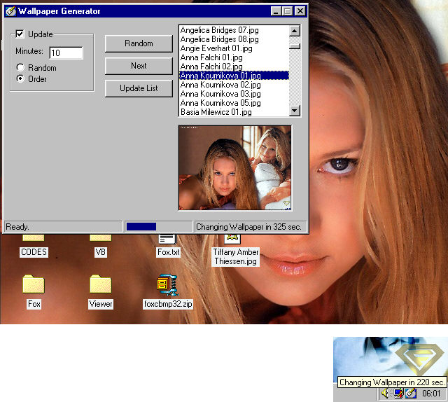



## Add SysTray\-Icon \+\+\+ Change Wallpaper

### Description

Did you ever want to let your Application appear in the SysTray, without any complicated code, completely bug-free and easy to handle using events? Or did you ever want to change the Windows-Settings like Wallpaper with VB?  This code does not only contain the source for a UserControl to easily create and handle SysTray-Icons or the code to change the Wallpaper, it is also a complete program to fresh your Desktop up: you can create a list of picture files and the program changes the Wallpaper after adjustable delays, running down your list. Furthermore the program is very flexible, it automatically stretches the pictures so they fit onto the screen, and it can handle all filetypes from Bitmaps over GIFs to JPEGs. Just copy some cool Wallpaper-files into the Folder "Wallpapers", type any number of minutes in the TextBox in my program, and enjoy your always different wallpaper! Also the program runs in the SysTray when minimized, so it doesn't block the TaskBar and is still accessable. About the SysTray-Icon Control: You just have to add the UserControl to your form, and your App appears in the SysTray. If you want 2 Icons in the SysTray, just add another Control. You can change the Icon and the ToolTip Text in the IDE and at runtime, and you can control the User actions easily through events. The control also allows you to display the window's system menu when you click on the Icon, if you want it to.  I hope this stuff helps you, and if you like it, please don't forget to leave feedback/votes!
 
### More Info
 

             |
---                |---
**Submitted On**   |2001-03-15 01:35:24
**By**             |[Florian Egel](https://github.com/Planet-Source-Code/PSCIndex/blob/master/ByAuthor/florian-egel.md)
**Level**          |Intermediate
**User Rating**    |4.6 (55 globes from 12 users)
**Compatibility**  |VB 4\.0 \(32\-bit\), VB 5\.0, VB 6\.0
**Category**       |[Custom Controls/ Forms/  Menus](https://github.com/Planet-Source-Code/PSCIndex/blob/master/ByCategory/custom-controls-forms-menus__1-4.md)
**World**          |[Visual Basic](https://github.com/Planet-Source-Code/PSCIndex/blob/master/ByWorld/visual-basic.md)
**Archive File**   |[CODE\_UPLOAD170713142001\.zip](https://github.com/Planet-Source-Code/florian-egel-add-systray-icon-change-wallpaper__1-21586/archive/master.zip)

